# SENTIENT: Road Infrastructure Risk Intelligence

SENTIENT is an end-to-end geospatial machine learning system that predicts future road infrastructure risk for Indian cities from satellite-observed environmental stress, then turns those predictions into decisions: which roads to inspect first, what happens if nothing is done, and how much budget early action saves.

It currently covers **Bengaluru, Mumbai, and Hyderabad** with monthly satellite observations from 2020 through 2024, and ships with a purpose-built decision interface called the **Command Center**.

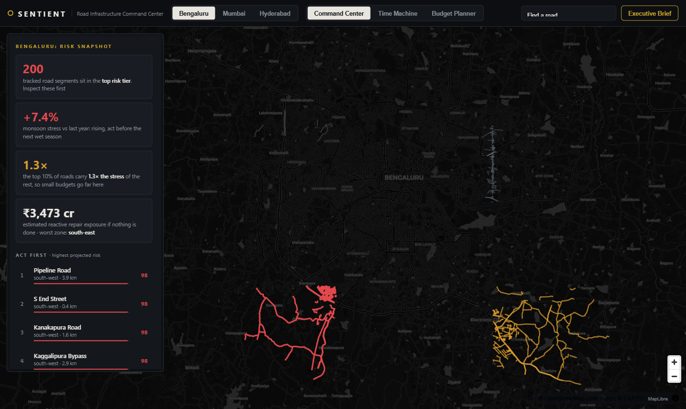

## Table of contents

- [Why this exists](#why-this-exists)
- [The Command Center](#the-command-center)
- [System architecture](#system-architecture)
- [Data sources](#data-sources)
- [Processing pipeline](#processing-pipeline)
- [Feature engineering](#feature-engineering)
- [Target definition](#target-definition)
- [Models](#models)
- [Evaluation](#evaluation)
- [From tiles to roads](#from-tiles-to-roads)
- [The dashboard payload](#the-dashboard-payload)
- [API reference](#api-reference)
- [Frontend engineering notes](#frontend-engineering-notes)
- [Project structure](#project-structure)
- [Quick start](#quick-start)
- [Configuration](#configuration)
- [Planning assumptions](#planning-assumptions)
- [Limitations and honesty notes](#limitations-and-honesty-notes)

## Why this exists

City infrastructure teams work with limited budgets and reactive complaint queues. By the time a road failure is visible on the ground, the cheap intervention window has already closed. Satellites see the stress building up months earlier: water pooling after every rain, ground staying saturated, heat cycling that expands and cracks surfacing, vegetation loss that removes natural drainage.

SENTIENT reads five years of that signal and answers three questions:

1. **Where should we act first?** A ranked, road-level priority list per city.
2. **What happens if we do nothing?** Trend projections and months-to-critical estimates.
3. **What does early action buy?** A budget simulator that converts preventive spending into estimated avoided reactive cost.

The audience is municipal commissioners, planning heads, and maintenance departments. The interface deliberately contains no machine learning jargon: no RMSE, no model names, no feature importance plots. Only priorities, drivers, timelines, and rupees.

## The Command Center

The frontend is a single-page map application served directly by the API at `http://localhost:8000`. It has three modes plus an export.

### Command Center (overview)

The landing view. A real dark basemap of the city with every analyzed road drawn as a colored corridor: red for critical, amber for watch, slate for stable. The left panel shows the city risk snapshot in plain language: segments in the critical band, monsoon stress versus last year, how concentrated the risk is, and the estimated reactive repair exposure if nothing is done. Below it, the "Act First" list ranks the highest priority named roads. Click any road, in the list or on the map, to drill down.

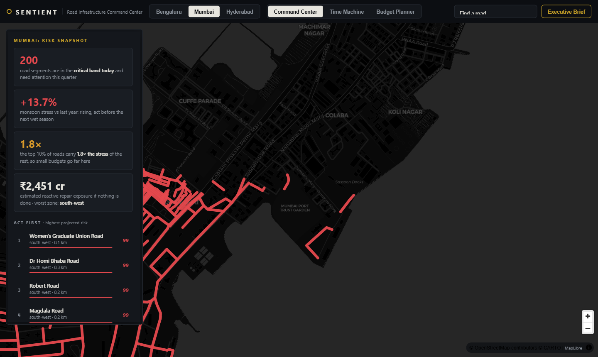

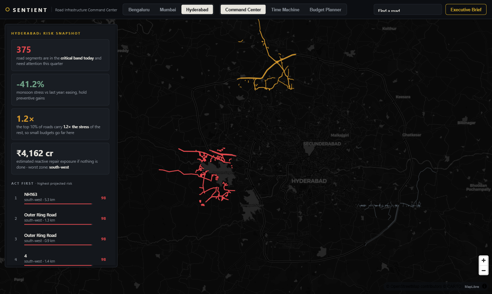

### Road drill-down

Every road opens a detail drawer: its priority score out of 100 (computed against every analyzed road in that city, not just the displayed sample), its city rank, months-to-critical countdown, the plain-language stress drivers behind its score with severity ratings, a five-year stress sparkline plotted against the critical band threshold, and a concrete recommended action with a timeframe. One click adds it to the maintenance plan.

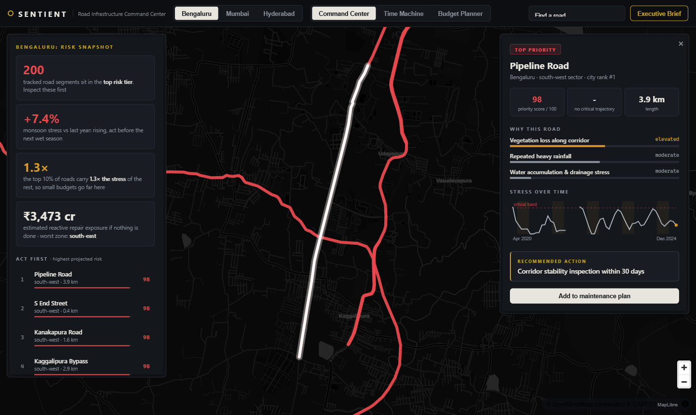

### Time Machine

The Time Machine replays 2020 to 2024 month by month and shows how the stress built up. Roads on the map re-color live as their condition changes between stable, watch, and critical. Three driver meters (rainfall loading, standing water, heat exposure) move with the data, a sector counter tracks how many of the 16 city sectors are under exceptional stress relative to their own history, and a narrated caption explains what is happening and where: which driver is doing the damage and which sector is taking the worst of it.

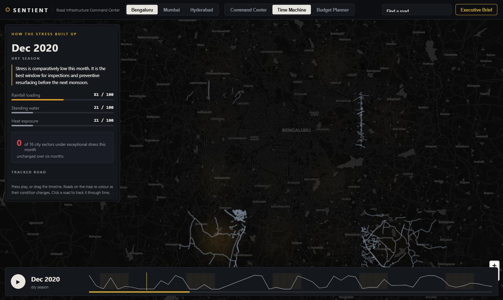

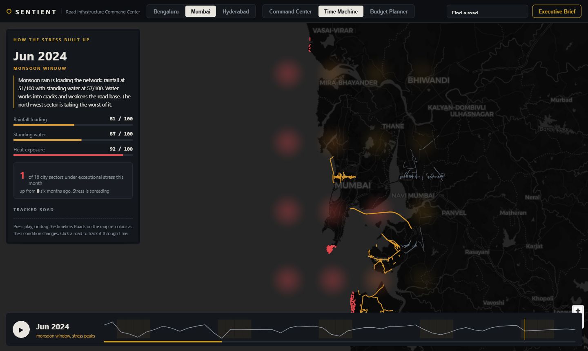

Click a road before pressing play to track it through time. The panel then reports that specific road's band at every month, with its dominant driver.

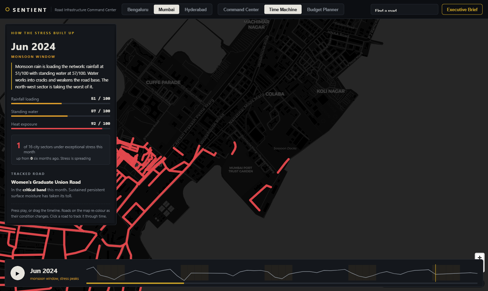

### Budget Planner

A what-if simulator. Drag the budget slider and SENTIENT greedily builds a work order from the highest risk roads, respecting per-road preventive resurfacing costs. The panel reports roads protected, kilometres resurfaced early, the share of the critical band secured, the estimated reactive cost avoided, and a rupee-for-rupee return line. Roads selected into the plan turn blue on the map. All planning assumptions are printed at the bottom of the panel and are meant to be replaced with department rate cards.

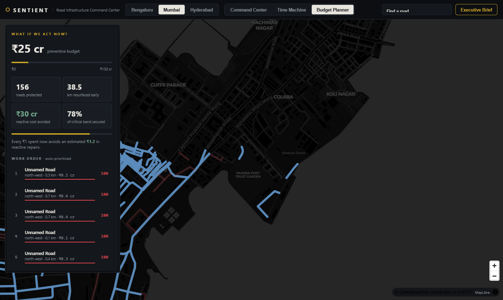

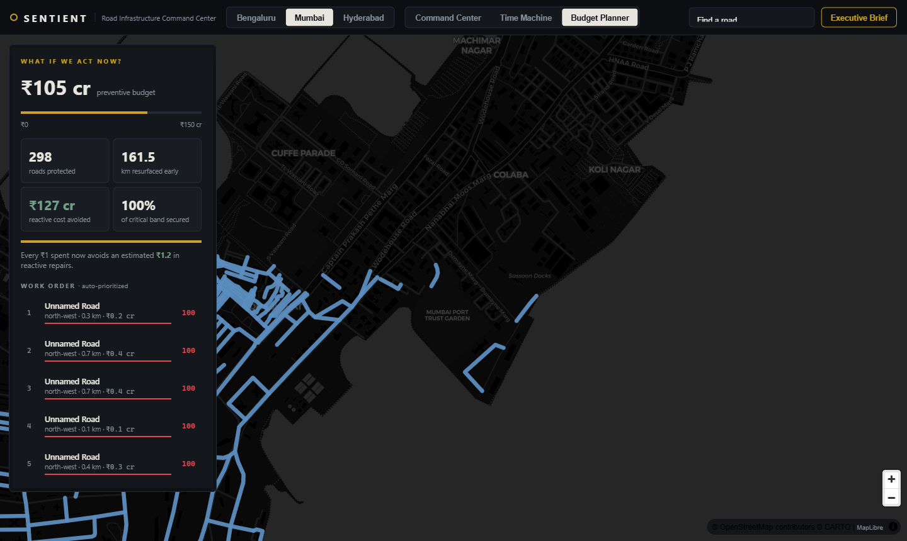

### Executive Brief

One click generates a print-ready document: headline KPIs, a recommended investment paragraph with the cost-benefit arithmetic spelled out, the top 20 priority roads with sectors, lengths, priority chips and recommended actions, and a six-month action plan. Print it or save it as a PDF from the browser.

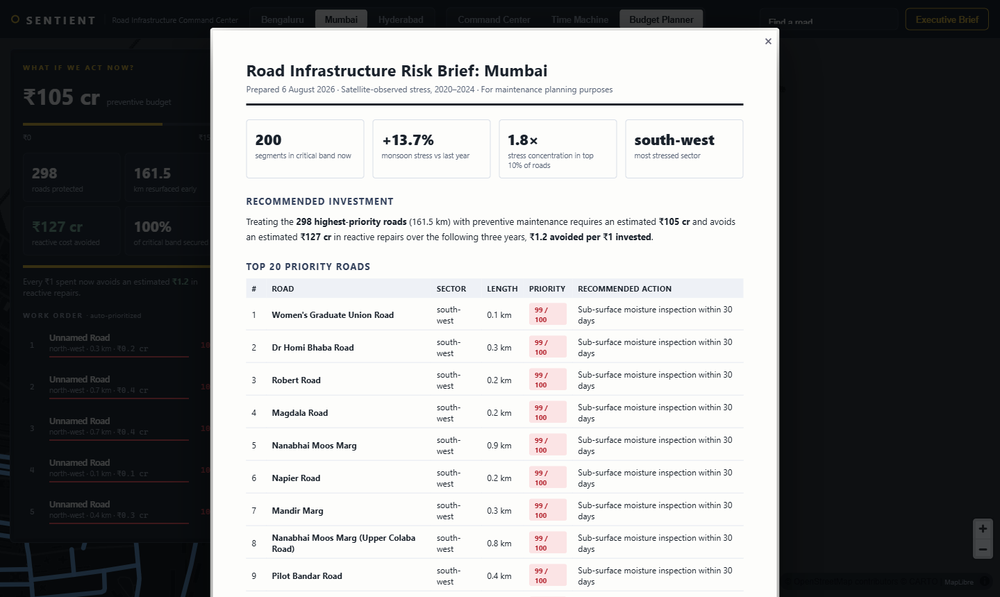

There is also road search from the top bar, ranked by risk:

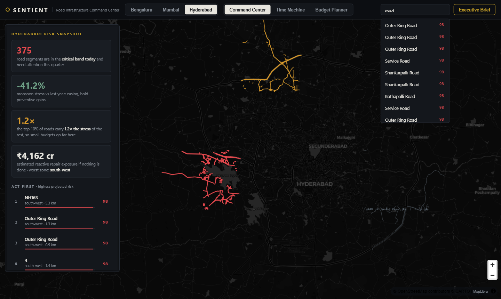

## System architecture

```text
  Sentinel-1  Sentinel-2  Landsat  ERA5  VIIRS  WorldPop  OSM
      |           |          |      |      |       |       |
      +-----------+----------+------+------+-------+-------+
                             |
                     [ingestion]  src/ingestion/*      raw GeoTIFF/NetCDF/JSON
                             |
                   [validation]  src/preprocessing/validate_raw_data
                             |
              [monthly stress]  src/preprocessing/monthly_stress
                             |    4x4 tile grid per city, 17 stress metrics/month
                             |
              [feature build]  src/features/build_dataset
                             |    temporal windows, 99 model features
                             |
        +--------------------+--------------------+
        |                                         |
  [tabular sweep]                        [cnn temporal track]
  src/training/train_models              src/training/train_cnn_temporal
  10 models, auto-selection              CNN+LSTM / CNN+TCN on image sequences
        |                                         |
  [scoring]  src/inference/score_risk    [scoring] score_risk_cnn_temporal
        |
  [evaluation]  src/evaluation/evaluate
        |
  [road risk]  src/features/build_road_risk
        |         road_risk_ranking.json + dashboard.json
        |
  [API + frontend]  src/api/main.py  +  src/frontend/web/
```

## Data sources

| Source | What it measures | Signals extracted |
|---|---|---|
| Sentinel-1 (SAR) | Radar backscatter, works through clouds | Surface roughness, flood/standing water fraction |
| Sentinel-2 (optical) | Multispectral imagery | NDVI (vegetation), NDWI (surface moisture), green band statistics |
| Landsat thermal | Land surface temperature | Mean thermal Kelvin, heat exposure fraction |
| ERA5 (ECMWF reanalysis) | Weather | Total precipitation mean and sum, 2 m air temperature |
| VIIRS Nightlights | Nighttime radiance | Economic activity and corridor usage proxy |
| WorldPop | Population rasters | Population density mean and p90 |
| OpenStreetMap | Road network | Way geometry, road class, name, length; road density per tile |

Each city is covered by a 4x4 tile grid over its bounding box. Every tile gets a monthly row of 17 stress metrics. The grids, date ranges, and satellite scales are configured per city in `config/pipeline.<city>.2020_2024.json`.

## Processing pipeline

1. **Ingestion.** One module per source under `src/ingestion/`. Rasters land in `data/raw/<source>/<year>/<month>/`, OSM extracts land as JSON. Every ingestor is idempotent and stamped.
2. **Validation.** `validate_raw_data` checks coverage per source and month before anything downstream runs, and writes `data/results/raw_data_validation.json`.
3. **Monthly stress.** Rasters are aggregated to the tile grid: means, p90s, fractions above thresholds. Output is one parquet per month per city under `data/processed/<city>/`.
4. **Dataset build.** Sliding temporal windows are cut per tile (details below) and written to `data/features/dataset.parquet` with a content-hashed `dataset_version`.
5. **Training, scoring, evaluation.** Detailed in the sections below.
6. **Road risk build.** Tile-level predictions are pushed down to individual OSM roads and packaged for the frontend.

## Feature engineering

Each training row is one tile at one month, predicting the next month. From a window of W consecutive months the builder derives 99 features (at the default W = 3):

- **Lagged levels.** All 17 stress metrics at lag 0, 1, and 2.
- **Stress accumulators.** 3-month rainfall sum, 3-month flood fraction sum, 3-month mean heat exposure.
- **Within-window dynamics.** For the 9 fast-moving signals: month-over-month delta, per-month linear trend, window maximum, and window standard deviation (volatility).
- **Calendar seasonality.** Sine and cosine of the target month. This is deterministic calendar knowledge, not observed data, so it is leakage-safe.
- **Cross-stress interactions.** rain x flood, heat x air temperature, rain x surface moisture, corridor load x flood. Compound stress is worse than the sum of its parts, and these terms let tree models find that directly.
- **City indicators.** One-hot city flags so a single general model can learn per-city offsets.

All features are z-normalized using statistics fit on the training era only (before the temporal cutoff), never on validation months. Windows must be strictly contiguous months; windows that would bridge a data gap are dropped rather than imputed.

## Target definition

The prediction target is a **relative future stress proxy** for the next month:

```text
target = precipitation_sum(next) + 2.0 * heat_exposure(next) + 3.0 * flood_fraction(next)
```

This is a deliberate engineering choice. Ground-truth road failure records with month-level timestamps are not publicly available for these cities, so the system learns to anticipate the environmental loading that degrades pavement, and every downstream number is treated as a **relative prioritization**, never an absolute failure probability. The evaluation section and the in-product language are both built around that honesty.

## Models

Training runs a 10-model sweep. All models train on identical features and an identical temporal split, and the best model is selected automatically.

| Mode | Model | Notes |
|---|---|---|
| `baseline` | Ridge regression | Lag-0 and accumulator features only, sanity floor |
| `temporal_gb` | HistGradientBoosting | sklearn native gradient boosting |
| `temporal_rf` | RandomForest | 300 trees, depth 12 |
| `temporal_et` | ExtraTrees | 600 trees, feature subsampling |
| `temporal_et_tuned` | ExtraTrees tuned | 1200 trees, max_features 0.4, leaf size 1 |
| `temporal_lgbm` | LightGBM | 900 rounds, lr 0.03 |
| `temporal_lgbm_tuned` | LightGBM tuned | 1800 rounds, lr 0.02, 63 leaves |
| `temporal_xgb` | XGBoost | 900 rounds, hist method |
| `temporal_blend` | Equal-weight blend | Mean of ET + RF + LGBM predictions |
| `temporal_stack` | Temporal-holdout stack | 5 base models, Ridge meta-learner fit on the most recent quarter of train |

Selection criterion, in order: top-decile lift, then Spearman rank correlation, then R2. Rank quality matters more than absolute error because the product is a priority list.

The split is strictly temporal: the most recent 30 percent of rows (by target month) are held out for validation. Nothing from the validation era touches training or normalization.

### Results

Validation metrics on the held-out most recent 30 percent (744 rows spanning 2023 to 2024). Lift maximum is 4.0.

| Model | MAE | R2 | Spearman | Top-decile lift |
|---|---|---|---|---|
| baseline (Ridge) | 1.496 | 0.616 | 0.705 | 3.73 |
| temporal_gb | 1.456 | 0.601 | 0.695 | 3.73 |
| temporal_rf | 1.337 | 0.650 | 0.726 | 3.84 |
| temporal_et | 1.354 | 0.652 | 0.727 | 3.89 |
| temporal_et_tuned | 1.358 | 0.655 | 0.729 | 3.89 |
| temporal_lgbm | 1.408 | 0.619 | 0.708 | 3.89 |
| **temporal_lgbm_tuned (deployed)** | **1.392** | **0.637** | **0.713** | **3.95** |
| temporal_xgb | 1.439 | 0.608 | 0.696 | 3.89 |
| temporal_blend | 1.357 | 0.649 | 0.727 | 3.84 |
| temporal_stack | 1.563 | 0.566 | 0.708 | 3.89 |

`temporal_lgbm_tuned` wins on the primary criterion with the highest top-decile lift recorded on this validation set (3.95 of a possible 4.0), and matches the strongest models in the most recent year (2024: Spearman 0.81, lift 4.0, R2 0.70).

A longer temporal window was also evaluated (window 6, 158 features, 2,176 rows). It degraded nearly every model because the extra history costs three months of training rows per tile, so window 3 remains the production configuration. The enriched feature set itself was a clear win: before within-window dynamics, seasonality, and interaction terms were added, the best model reached Spearman 0.694 and lift 3.89; the sweep above starts from that improved base.

There is also an independent **CNN temporal track** (`train_cnn_temporal.py`): compact monthly GeoTIFFs are stacked into image sequences and fed through a shared CNN encoder into either an LSTM or a TCN head. It is kept as a second opinion and scored separately into `risk_scores_cnn_temporal.parquet`.

## Evaluation

`src/evaluation/evaluate.py` scores the deployed model's risk scores against the proxy target across all 2,480 windows:

- **Spearman rank correlation** between predicted risk and realized next-month stress.
- **Top-decile lift**: how much more likely a top-10-percent-ranked tile-month is to land in the top quartile of realized stress, versus base rate. The theoretical maximum is 4.0.
- Both metrics are also reported **per year** to expose regime drift.
- **Overfit guardrails**: the evaluator flags suspiciously high correlations or lift as potential leakage instead of celebrating them.

Current deployed-model results: Spearman 0.93 and top-decile lift 3.98 across all 2,480 windows. The years 2020 to 2022 fall inside the training era (near-perfect scores there simply confirm fit); the honest out-of-sample years are 2023 (Spearman 0.84, lift 3.93) and 2024 (Spearman 0.81, lift 4.0). No guardrail flags are raised.

## From tiles to roads

Commissioners do not act on tiles, they act on roads. `build_road_risk.py` bridges the gap:

1. **Recent risk per tile.** Tile scores are averaged over the most recent six predicted months, not the all-time mean, so the ranking reflects the current state.
2. **Road overlay.** Every OSM way is walked node by node, its length computed by haversine, and each vertex mapped to its tile. A road's risk is the mean of the tiles it crosses.
3. **Relative tiers.** Within each city, the top 15 percent of roads by risk are Critical, the next 35 percent Watch, the rest Stable. The system predicts relative prioritization, so tiers are relative by design.
4. **Priority score.** Every displayed road gets a 0-100 percentile computed against all analyzed roads in its city (over one hundred thousand ways per city), not against the displayed sample. A score of 97 means this road carries more projected stress than 97 percent of the city's roads.
5. **Stress drivers.** Per tile, six driver intensities (rainfall, standing water, heat, surface moisture, corridor load, vegetation loss) are percentile-ranked within the city. Each road inherits the average of its tiles and shows its top three with plain-language labels.
6. **Trend and countdown.** Each road carries its full monthly risk series. A linear fit over the last eight observations extrapolates months-to-critical where the trajectory is rising.
7. **Recommended action.** A rule table maps tier plus dominant driver to a concrete next step, for example Critical plus standing water becomes "Drainage audit within 2 weeks".
8. **Stratified selection.** For the map, 500 roads per city are selected: 40 percent Critical, 35 percent Watch, 25 percent Stable, so every tier is visible on screen.

## The dashboard payload

`data/results/dashboard.json` (about 1.8 MB) is a single precomputed payload that the frontend loads once. Per city it contains the bounding box, the risk snapshot summary (critical-now count, monsoon stress year over year, risk concentration ratio, worst sector, network length), the 16 tile centroids with their full monthly risk series for the heat layer, and monthly driver indices (rainfall, standing water, heat, each rank-normalized 0 to 100 across months) that power the Time Machine meters and captions. Per road it contains geometry, tier, priority score, city rank, drivers, action, trend series, and months-to-critical.

Everything interactive in the UI happens client-side against this payload, so the product stays responsive with zero server round-trips after load.

## API reference

| Endpoint | Description |
|---|---|
| `GET /` | The Command Center UI |
| `GET /dashboard` | Full dashboard payload (above) |
| `GET /metadata` | Config, data inventory manifest, validation report, evaluation |
| `GET /risk/latest?limit=&model=` | Highest risk rows, tabular or cnn_temporal track |
| `GET /risk/ranking?by=tile\|zone\|row` | Aggregated risk ranking with tile centroids |
| `GET /risk/by_zone` | Zone-level mean risk |
| `GET /risk/heatmap` | Tile centroid risk points |
| `GET /risk/roads?limit=` | Road ranking with geometry |

## Frontend engineering notes

- **No framework, no build step.** Three files: `index.html`, `styles.css`, `app.js`. The only runtime dependency is MapLibre GL JS, loaded from a CDN.
- **Map.** MapLibre over CARTO dark raster tiles (OpenStreetMap data), so localities, street names, and water bodies are all present and the city is instantly recognizable. Risk roads are GeoJSON line layers with feature-state driven colors, so re-coloring 500 roads per animation frame during Time Machine playback costs no re-parse.
- **Interaction.** A 16 px invisible hit layer makes hovering thin lines comfortable. Hover raises width via feature state; click opens the drawer and fits bounds with padding clamped to the viewport.
- **Time Machine mechanics.** Playback advances one month every 380 ms. Per month, every road's 3-month smoothed value is classified against banding cuts derived from the city's full 2020 to 2024 distribution, and every sector is compared against its own history's 85th percentile. Smoothing plus historical banding is what makes the animation read as gradual degradation instead of noise.
- **Design system.** One accent color (bureau amber), flat surfaces, 1 px borders, semantic tier colors only where they carry meaning: red critical, amber watch, slate stable, blue in-plan. No gradients, no glow, tabular numerals for all statistics.
- **Robustness.** If `requestAnimationFrame` is stalled (hidden or throttled contexts), the app installs a timer-based frame source before booting MapLibre. Asset URLs carry version query strings for cache busting.

## Project structure

```text
sentient/
  config/                          per-city pipeline configs
  data/
    raw/                           ingested satellite/weather/OSM data
    processed/<city>/              monthly tile stress parquets
    features/                      dataset.parquet + normalization stats + manifest
    results/                       risk scores, rankings, dashboard.json, evaluation
  docs/                            documentation and screenshots
  models/                          trained models + training metrics
  scripts/                         pipeline runners and smoke tests
  src/
    ingestion/                     one module per data source
    preprocessing/                 validation + monthly stress aggregation
    features/                      dataset builder + road risk builder
    training/                      tabular sweep + CNN temporal track
    inference/                     scoring for both tracks
    evaluation/                    proxy evaluation with guardrails
    api/                           FastAPI service, serves API + frontend
    frontend/web/                  the Command Center (html/css/js)
  tests/smoke/                     artifact contract tests
```

## Quick start

Requires Python 3.12+ and pip.

```powershell
python -m pip install -r requirements.txt
```

Run the full pipeline for a city (ingestion needs the relevant API credentials in `.env`):

```powershell
powershell -ExecutionPolicy Bypass -File scripts/run_pipeline.ps1 -ConfigPath "config/pipeline.bengaluru.2020_2024.json" -ModelTrack both
```

If the data artifacts already exist (they ship with this repo), you can retrain and rebuild directly:

```powershell
python -m src.features.build_dataset --city "Bengaluru,Mumbai,Hyderabad" --window-size 3
python -m src.training.train_models --dataset data/features/dataset.parquet --val-fraction 0.3
python -m src.inference.score_risk --dataset data/features/dataset.parquet --model models/best_model.joblib
python -m src.evaluation.evaluate
python -m src.features.build_road_risk --city "Bengaluru,Mumbai,Hyderabad" --max-roads 1500
```

Serve the API and the Command Center:

```powershell
python -m uvicorn src.api.main:app --host 127.0.0.1 --port 8000
```

Open `http://localhost:8000`. Smoke tests:

```powershell
python -m pytest tests/smoke -q
python scripts/smoke_test_api.py
```

## Configuration

Each city has a config in `config/`:

```json
{
  "city": "Bengaluru",
  "bbox": "77.45,12.8,77.75,13.1",
  "start_date": "2020-01-01",
  "end_date": "2024-12-31",
  "window_size": 3,
  "grid_size": 4,
  "sentinel1_scale": 120,
  "sentinel2_scale": 60,
  "sentinel2_max_cloud": 40
}
```

Adding a city means adding a config, running the pipeline for it, adding its bounding box to `BBOX_BY_CITY` in `build_road_risk.py`, and rebuilding the multi-city dataset.

## Planning assumptions

The budget arithmetic uses three published constants, all adjustable in `src/frontend/web/app.js` and printed inside the product:

| Constant | Value | Meaning |
|---|---|---|
| `COST_PER_KM_CR` | 0.65 | Preventive resurfacing cost, crore rupees per km |
| `REACTIVE_MULT` | 3.2 | Reactive repair cost multiplier versus preventive |
| `FAIL_LIKELIHOOD` | 0.55 | Modelled 3-year failure likelihood inside the critical band |

These are planning-grade defaults intended to be replaced with department rate cards.

## Limitations and honesty notes

- **The target is a proxy.** Without public ground-truth failure logs, the model anticipates environmental loading, not confirmed failures. Everything is a relative priority, and the UI says so.
- **Tile resolution.** Risk is modelled on a 4x4 grid per city, so roads inside one tile share a satellite signal. The Time Machine reports sector-level stress for exactly this reason, and finer grids are the single highest-value upgrade.
- **Unnamed roads.** OSM coverage in these cities includes many unnamed ways. They are ranked and mapped, but the work order and brief prefer named roads at equal risk so the output is actionable.
- **Cost figures are estimates.** The budget planner is a decision aid, not a tender document.
